---

title: 概率论与数理统计第一章
draft: false
author: 贺昌嘉
tags: 
  - 总结
  - 笔记
created date: 2025年5月20日09:59:57

---

```markmap
---
markmap:
  zoom: false
  pan: false
  height: 300px
  backgroundColor: "#f8f8f8"
---

# 随机事件及其概率
# 基本概念
## 随机试验与基本结果
## 样本空间与样本点
# 随机事件
## 随机事件的运算
## 随机事件的关系
# 随机事件的概率
## 频率与概率
## 概率以及性质
### 概率的性质
# 重要概念
## 古典概率模型
## 条件概率
## 全概率公式
## 贝叶斯公式
## 伯努利试验
# 练习题
```

# 随机事件及其概率

```kanban
Briefly Abstract
# Briefly Abstract

## 基本概念
- 随机试验
- 基本结果
- 样本空间
- 样本点

## 随机事件
- 定义
- 运算及运算律
- <font color=#FF1CAE>关系</font>
- <font color=#FF1CAE>概率的定义以及性质</font>

## 重要概念
- 古典概率模型
- <font color=#FF1CAE>条件概率</font>
- <font color=#FF1CAE>全概率公式与贝叶斯公式</font>
- 伯努利试验

```



[TOC]

---

# 基本概念

## 随机试验与基本结果

**随机试验:**简称试验,一般用大写字母*$E$*(Experiment)来表示.满足以下三个特征:

1. 重复性:实验条件等可以复现.
2. 多样性:可能的结果不止一个,并且所有可能的结果已知.
3. 随机性:每个可能的结果随机出现.

**基本结果:**试验中出现的各种可能结果.

## 样本空间与样本点

> [!Tip]
>
> **Definition:**
>
> 1. 样本空间:*试验*中所有可能出现的基本结果所组成的集合称为试验的**样本空间(Sample Space)**,用大写字母**$S$**来表示.
> 2. 样本点:样本空间$S$中的基本元素,试验中的基本结果,称为样本点.

# 随机事件

> [!Tip]
>
> **Definition:**
>
> *随机事件*是样本空间$S$的子集,一般用大写字母$A,B,C,\cdots$来表示.只包含一个样本点的随机事件称为*基本事件*.包含所有样本点的随机事件称为*必然事件*.由定义,事件$\empty$不包含任何样本点,称为*不可能事件.*

## 随机事件的运算

对随机事件$A,B,C,\cdots$ 有如下*运算关系*:

1. 事件的和: 称事件$A \cup B = \{ x | x\in A 或者 x \in B\}$为事件$A$与事件$B$的和事件.
2. 事件的积:称事件$A \cap B = \{x | x \in A且 x \in B\}$为事件$A$与事件$B$的积事件.
3. 事件的差:称事件$A-B = \{x | x \in A 且 x \notin B\}$为事件A与事件B的差事件.事件$A$发生而事件$B$不发生,即$A-AB$

**运算律:**

1. 交换律: $A \cup B = B \cup A;A \cap B=B \cap A$
2. 结合律: $A \cup (B \cup C) = (A \cup B) \cup C; A \cap (B \cap C) = (A \cap B) \cap C$
3. 分配率: $A \cup (B \cap C) = (A \cup B) \cap (A \cup C); A \cap (B \cup C) = (A \cap B) \cup (A \cap C)$
4. 对偶律: $\overline{A \cup B} = \bar{A} \cap \bar{B}; \overline{A \cap B} = \bar{A} \cup \bar{B}$

其中,分配律和对偶律均可推广到有限个事件.


## 随机事件的关系

1. 包含关系: 称$\{x | 对 \forall x \in B,x \in A成立\}$为$B \subset A$,事件$B$为事件$A$的子集.
2. 相等关系: 若存在 $A \subset B且B \subset A$,则称事件$A,B$相等.
3. 互斥关系: 若存在$A \cap B = \empty$,则事件$A , B$不可能同时发生,称为互斥事件.
4. 对立关系: 若存在$A \cap B =\empty,且 A \cup B =S$,即事件$A = B^{\complement}$,称为对立关系.

# 随机事件的概率

## 频率与概率

**频率:**在某$n$次试验中,事件$A$发生的次数为$N$,称比值$\frac{N_A}{n}$为事件$A$在这$n$次试验的**频率**.

频率的基本性质:

1. 非负性: $0 \le f_{n}(A) \le 1$

2. 规范性: $f_n(S) = 1$

3. 可加性; 若事件$A_1,A_2,A_3,\cdots,A_k$互不相容,那么
   $$
   f_n(A_1 + A_2 + A_3+\cdots+A_k) =f_n(A_1) + f_n(A_2) +f_n(A_3) +\cdots+ f_n(A_k)
   $$

当试验次数$n$逐渐增大时,频率$f_n(A)$逐渐趋于某一常数,这个常数称为事件$A$的概率.

## 概率以及性质

**概率:**当试验次数$n \to \infty$时,事件$A$发生的频率$f_n(A)$在一定意义下曲靖于事件$A$发生的概率$P(A)$.


### 概率的性质

1. 对于不可能事件$\empty$,概率$P(\empty) = 0$

2. 概率的有限可加性:
   $$
   P(A_1 + A_2 + A_3+\cdots+A_k) =P(A_1) + P(A_2) +f_n(A_3) +\cdots+ P(A_k) \label{vital}
   $$

3. 对于对立事件$A ,\bar{A}$,其概率有$P(A) = 1 - P(\bar{A})$

   简要证明: $1 = P(S) = P (A \cup \bar{A}),根据\ref{vital},=P(A) + P(\bar{A}).\Box$

4. 对于包含事件:$B \subset A$,其概率$P(A -B) = P(A) - P(B)$

   简要证明:由关系$B \subset A$,那么$A = B \cup (A-B)$,$P(A) = P(B \cup (A-B)),再有\ref{vital},=P(B) + P(A-B)\Box$

   此外:由概率的非负性,那么$P(A)- P(B)\ge 0 \Longleftrightarrow P(B) \le P(A)$

5. 概率的加法公式: 对任意两个事件$A,B$,可以推广到多个事件
   $$
   P(A + B) = P(A) + P(B) -P(AB)
   $$
   对多个事件如$A_1,A_2,A_3$,
   $$
   P(A_1+A_2+A_3) = P(A_1) + P(A_2) + P(A_3) - P(A_1A_2) - P(A_1A_3) - P(A_2A_3) + P(A_1A_2A_3)
   $$
   


# 重要概念

## 古典概率模型

又称为等可能概率模型,事件$A$发生的概率为:
$$
P(A) = \frac{k}{n}=\frac{事件A包含的基本事件}{S包含的基本事件}
$$

## 条件概率


## 全概率公式


## 贝叶斯公式


## 伯努利试验


# 练习题

